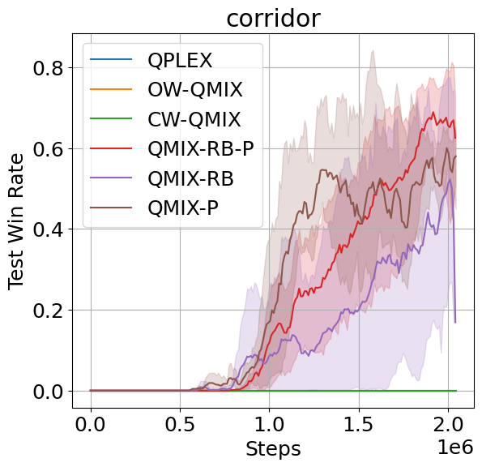
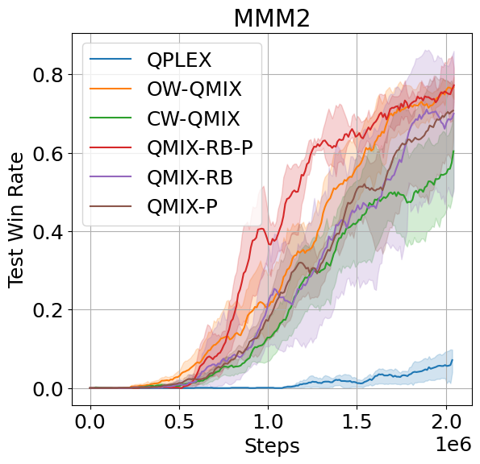
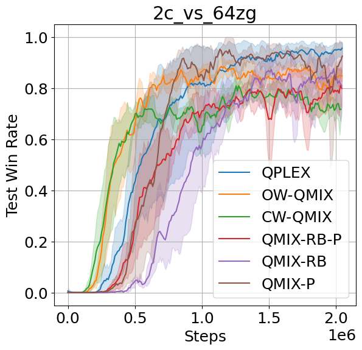

# Comparison with QPLEX and WQMIX

This page contains plots with performance of the proposed algorithms, QPLEX and WQMIX on the SMAC environment.

QMIX-RB-P stands for QMIX with replay buffer and exploration policy modifications; QMIX-RB stands for QMIX with replay buffer modification, and QMIX-P stands for QMIX with exploration policy modification. Plots show the mean and 95% confidence interval across five runs.

